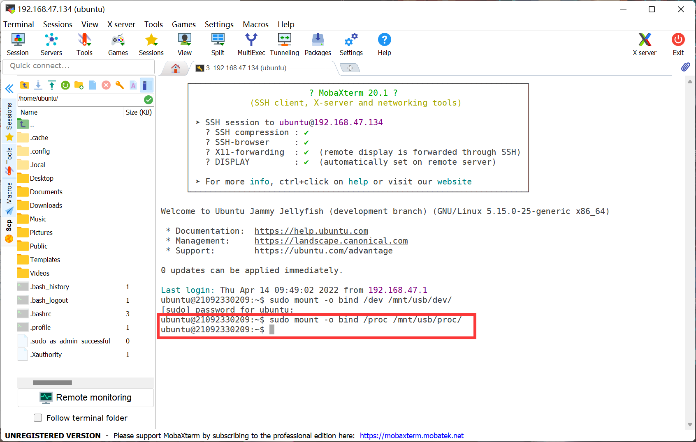
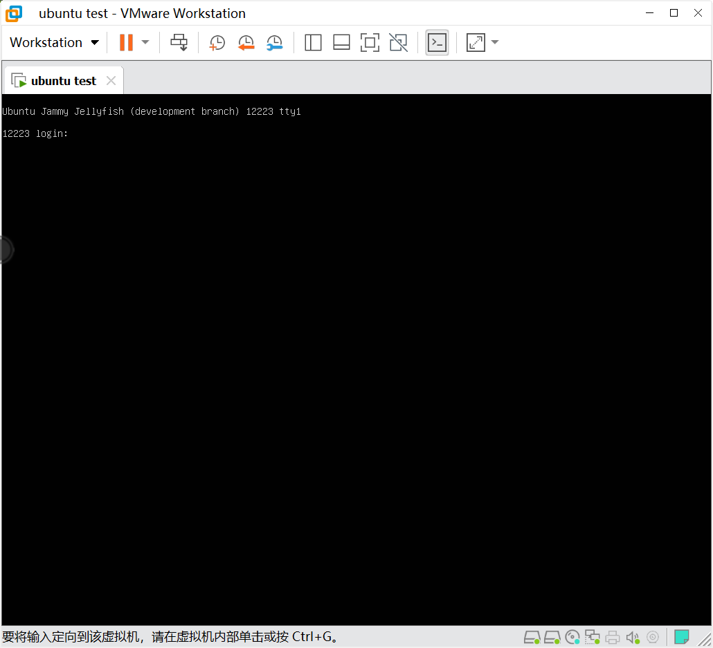

## 创建一个B系统

###### ####如果关机重启了得重新挂载####

1.下载linux镜像文件

`sudo debootstrap --arch=amd64 focal /mnt/usb/ https://mirrors.ustc.edu.cn/ubuntu/`
##### 如果下载过慢可以换源，将https://mirrors.ustc.edu.cn/ubuntu/跟换其他源

#### 将镜像文件转移

`sudo genfstab -U /mnt/usb/ > /mnt/usb/tmp/fstab`

#### 将a盘中的源复制到b盘中

`sudo cp /etc/apt/sources.list /mnt/usb/etc/apt/`

#### 修改b系统的源

#### 进入虚拟机中操作

`sudo gedit /mnt/usb/etc/apt/sources.list`

#### 将jammy替换成focal （根据镜像作为选择）

#### 保存退出，继续到mobaxterm上操作

#### 添加三个挂载

`sudo mount -o bind /dev /mnt/usb/dev/`

 `sudo mount -o bind /proc /mnt/usb/proc/`

`sudo mount -o bind /sys /mnt/usb/sys`

#### 进入B系统

`sudo chroot /mnt/usb/ /bin/bash`

`mv /tmp/fstab /etc/fstab`

#### 装内核

`apt install linux-image-generic`

下载中途会弹出选择的下载位置

按esc

选择第二个

空格选择（带星号的代表已选中）

回车确认

#### 给B系统管理员用户设置密码

`passwd`

#### 新建一个用户ubuntu

`useradd ubuntu -m`

#### 给ubuntu用户设置密码

`passwd ubuntu`

#### 给B系统装上vim

`apt install vim`

#### 对用户列表进行编辑

`visudo`

#### 修改

#### i 进入编辑模式

#### 将%admin ALL=(ALL:ALL) ALL 改成 %ubuntu ALL=(ALL:ALL) ALL

#### esc退出编辑模式

#### ：wq退出

#### 安装引导

`apt install efibootmgr grub-efi-amd64`

#### 挂载

`mount -t efivarfs efivarfs /sys/firmware/efi/efivars/`

`grub-install -v --target=x86_64-efi --recheck /dev/sdb`

#### 修改grub的内容

`vim /etc/default/grub`

#### 在GRUB_CMDLINE_LINUX_DEFAULT="quiet splash"前面加上#

#### 保存退出

`:wq` 

#### 更新一下grub

`update-grub`

#### 退出B系统

`exit`

#### 打开虚拟机，重新启动，在重新启动的过程中连续点击esc键来切换系统

#### 出现如下界面即可

#### 选择系统

#### 出现如下界面

#### 输入ubuntu、密码，登录系统

### [返回目录-Linux初级指导教程](https://nya-wsl.com/Linux初级指导教程/)

