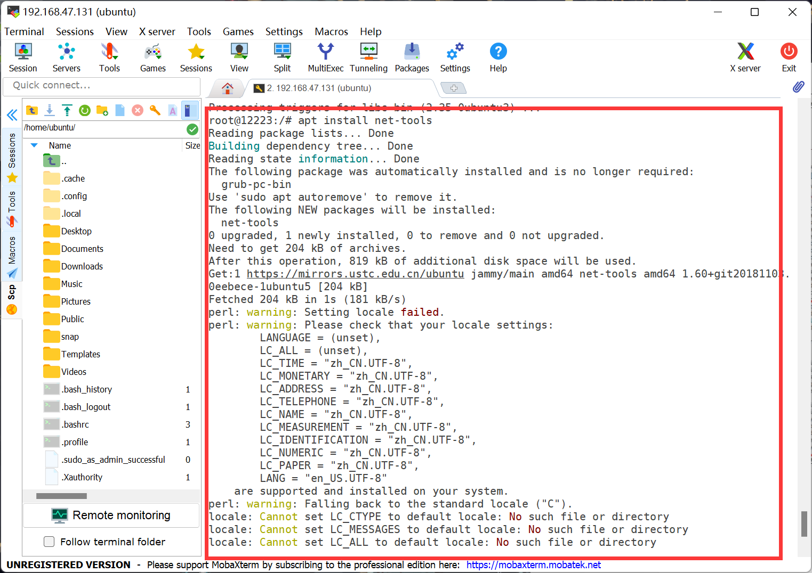

## 创建网络

#### 在新的B系统当中是没有网络以及IP的，我们需要设置一下网络。

#### 如果每次关机后，再打开虚拟机都得重新做挂载

#### 1.挂载：

sudo mount /dev/sdb2 /mnt/usb/

`sudo mount /dev/sdb1 /mnt/usb/boot/efi/`

#### 挂载：

`sudo mount -o bind /dev/ /mnt/usb/dev/`

`sudo mount -o bind /proc/ /mnt/usb/proc/`

`sudo mount -o bind /sys/ /mnt/usb/sys`

#### 2.更新

`sudo apt update`

#### 3.进入B系统

`sudo chroot /mnt/usb/ /bin/bash`

#### 4.下载network-manager

`apt install network-manager`

#### 5.下载ssh

`apt install openssh-server`

#### 6.下载net-tools

`apt install net-tools`

#### 7.打开虚拟机进入B系统

#### 8.输入ubuntu登录

### 9.补全share

补全：bash （临时的）

`bash`

#### 永久补全

`chsh -s /bin/bash`

#### 退出重新登录ubuntu

exit

## 请求IP

#### 1.临时请求IP

`sudo dhclient ens33`

#### 2.永久IP

#### 启动网络管理：

`sudo systemctl restart NetworkManager`

#### 查看启动状态

`sudo systemctl status NetworkManager`

#### q 退出

#### 打开开机自启

`sudo systemctl enable NetworkManager`

#### 编辑文本

`sudo vim /usr/lib/NetworkManager/conf.d/10-globally-managed-devices.conf`

#### i 进入编辑模式

#### 在*,后面加上

`except:type:ethernet,`

#### esc 退出编辑模式

#### ：wq保存退出

#### 重新启动NetworkManager

`sudo systemctl restart NetworkManager`

#### 查看IP

`ip a`

#### 重启sshd

`sudo systemctl restart sshd`

#### 设置开机自启sshd

`sudo systemctl enable sshd`

#### 设置完成后就可以连接mobaxterm

#### 连接时系统会提醒你是不是换了系统，选择是皆可。

### [返回目录-Linux初级指导教程](https://nya-wsl.com/Linux初级指导教程/)