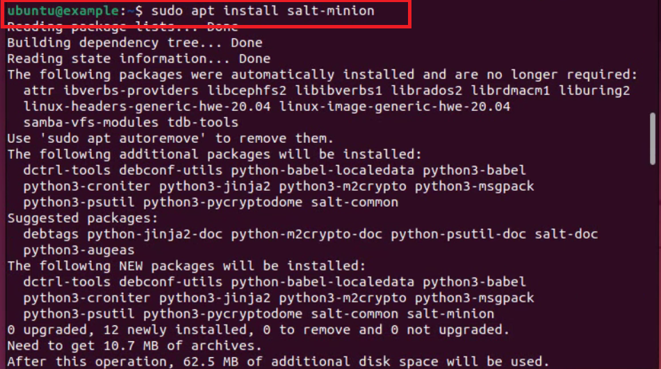
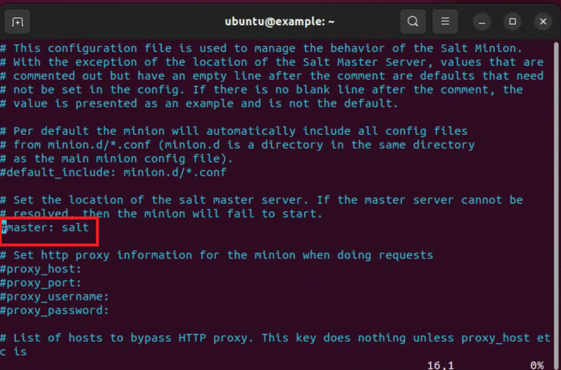
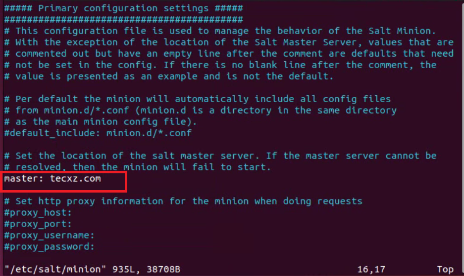
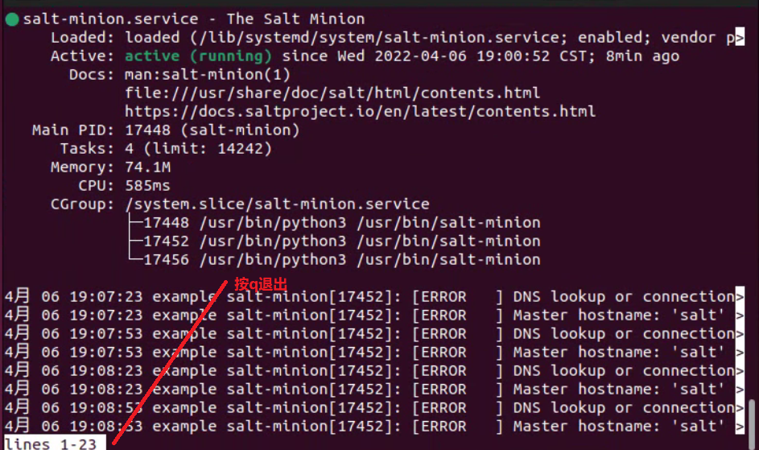
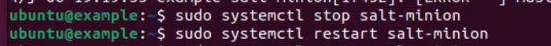
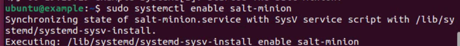

### 安装salt-minion:

`sudo apt install salt-minion`

### 先进入文本：

`sudo vim /etc/salt/minion`

#### 使用文本编辑器按a改#master：salt，将#删除由蓝色变成白色后将salt改为master：tecxz.com,之后按esc退出编辑模式按：wq

### 启动salt-minion：

`sudo systemctl start salt-minion`

### 查看状态：

`sudo systemctl status salt-minion`

### 先停止服务后重启:

`sudo systemctl stop salt-minion`

`sudo systemctl restart salt-minion`

### 然后使其开机自启：

`sudo systemctl enable salt-minion`

### [返回目录-Linux初级指导教程](https://nya-wsl.com/Linux初级指导教程/)