## 安装和配置samba

安装samba：`sudo apt install samba`

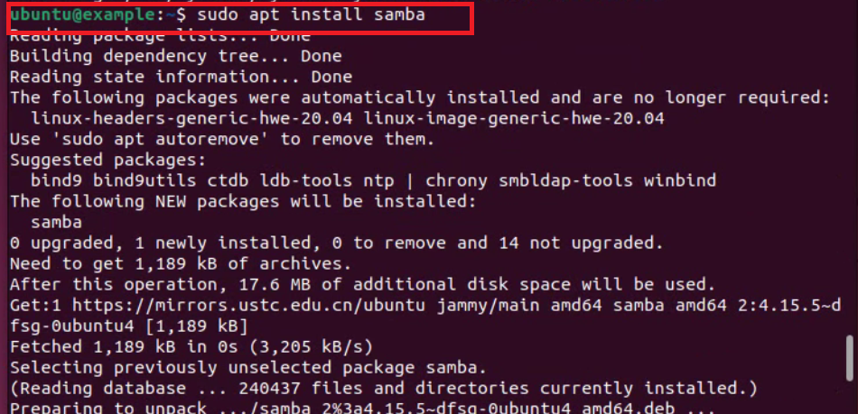

创建用户:`sudo useradd share`

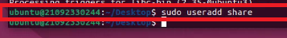

设置samba口令:`sudo smbpasswd -a share`

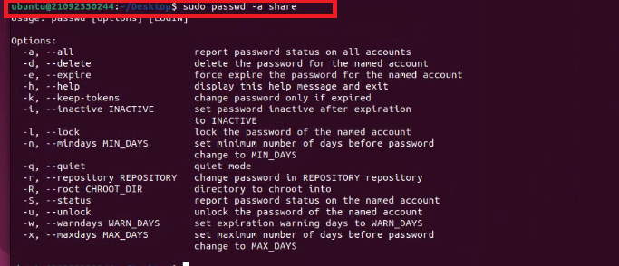

建立目录用来存放文件:`sudo mkdir /data`

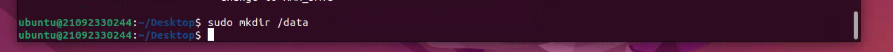

用用户名目标文件:`sudo chown share.share /data`

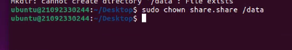

删除一个文件:`sudo rm /etc/samba/smb.conf`

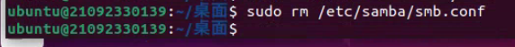

打开浏览器搜索http://tecxz.com:9090/class/

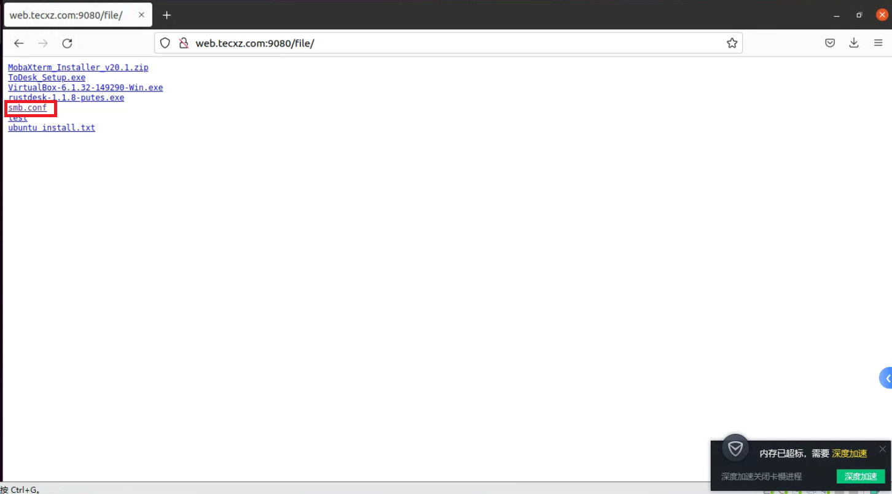

右击保存

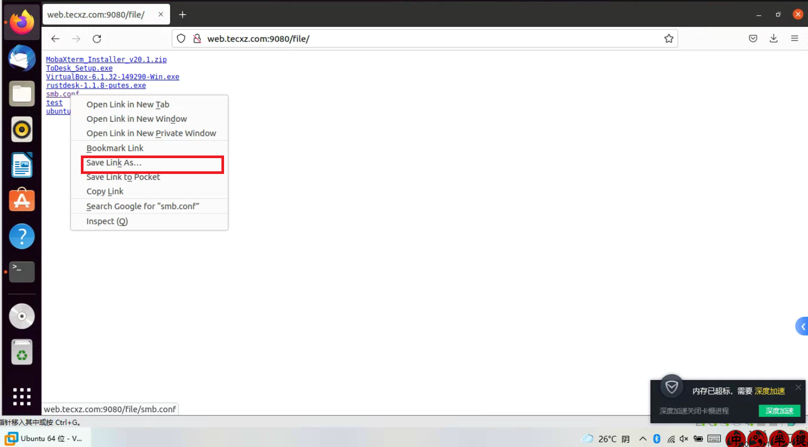

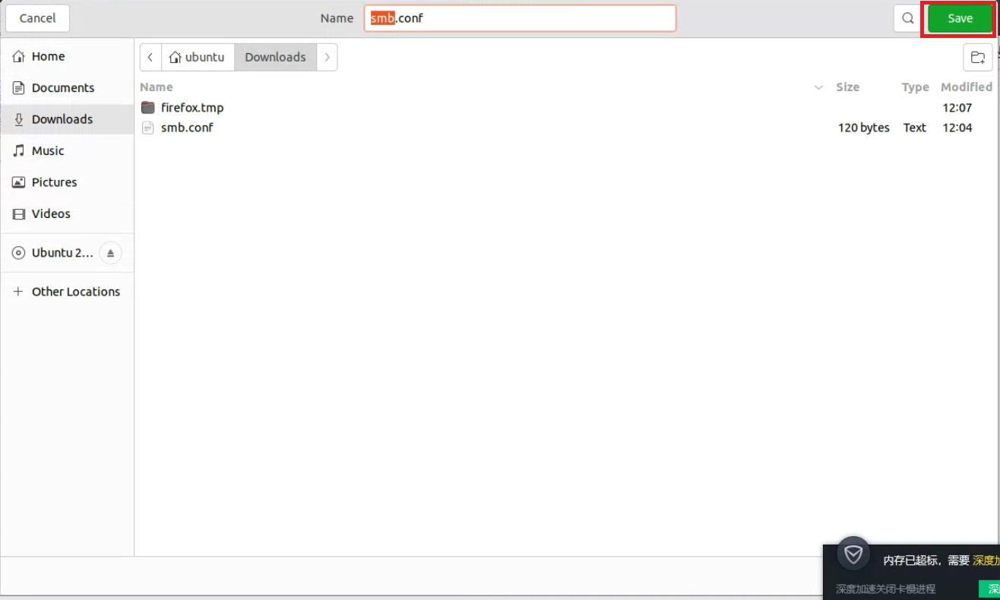

用vim打开文件:`vim smb.conf`,查看是否有问题，若无问题则退出

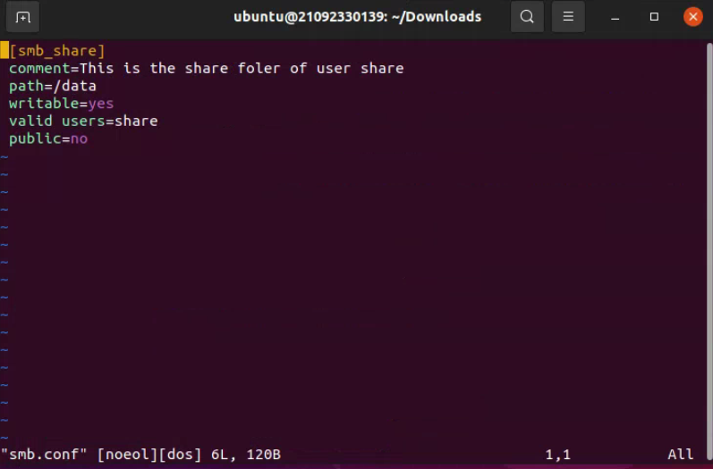

将文件移动到samba目录下:`sudo mv smb.conf /etc/samba`

### 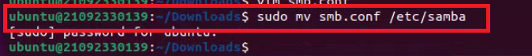

重启服务:`sudo systemctl restart smbd.service`

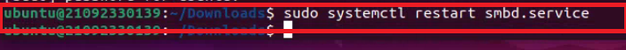

查看服务状态:`sudo systemctl status smbd.service`

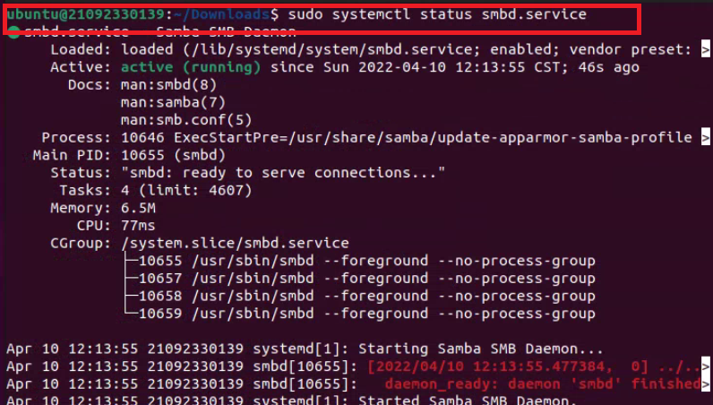

查看当前IP:`ip a`

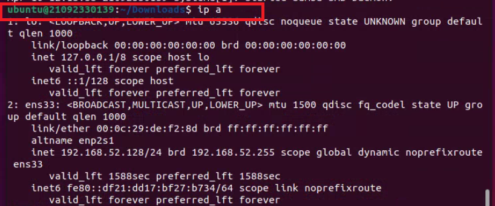

使smb开机自启:`sudo systemctl enable smbd.service`

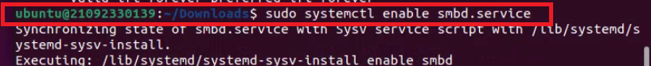

### 在windows中在此电脑中访问ip

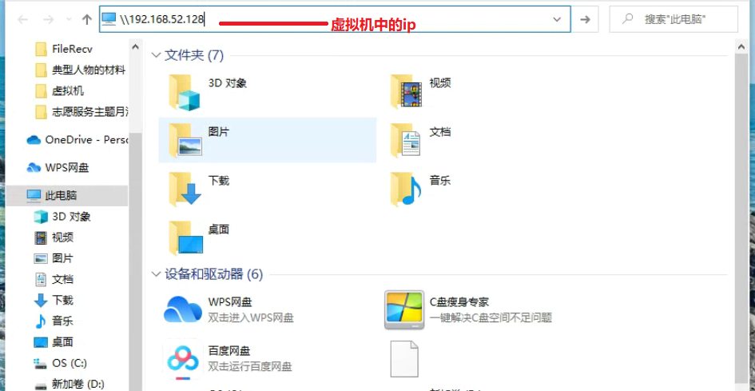

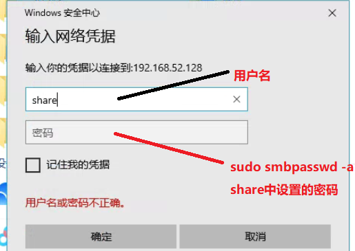

### 接下来会出现一个smb的文件夹

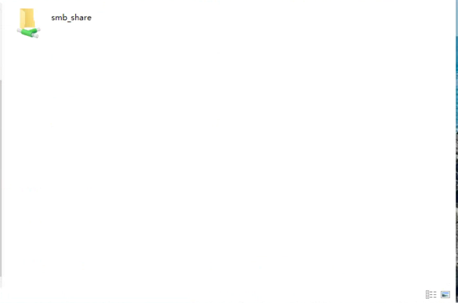

### 将ubuntu中的文件复制到次文件夹中:

`sudo cp ../Downloads/sogou /data`

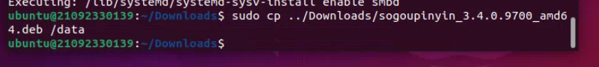

### 然后去windows上的文件夹中查看

### [返回目录-Linux初级指导教程](https://nya-wsl.com/Linux初级指导教程/)