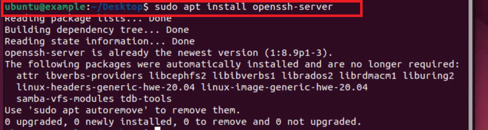
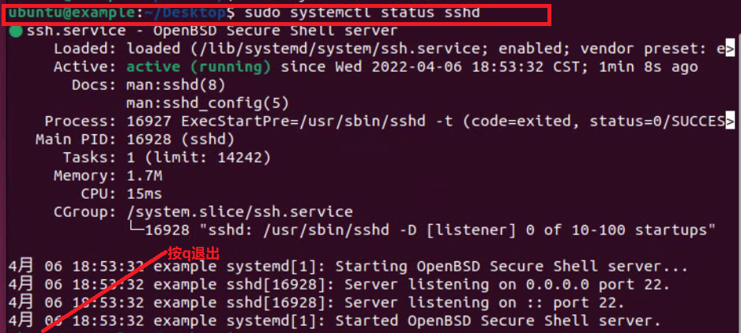
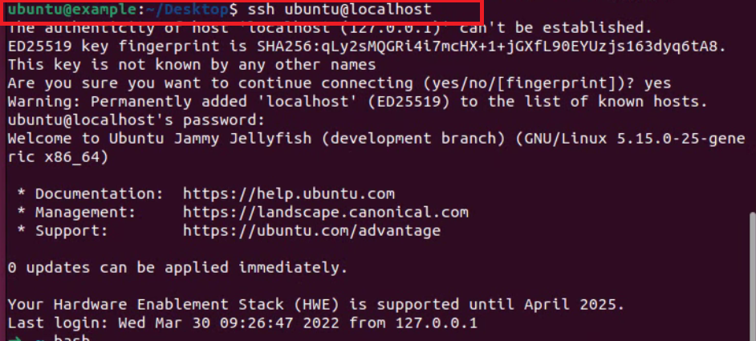

### 先安装一个openssh-server:

`sudo apt install openssh-server`

### 启动服务:

`sudo systemctl restart sshd`

### 查看服务:

`sudo systemctl status sshd`,查看完以后按q退出

### 下次开机自动开启：

`sudo systemctl enable sshd`

### 连接本机sshd服务：

`ssh ubuntu@localhost`

### [返回目录-Linux初级指导教程](https://nya-wsl.com/Linux初级指导教程/)