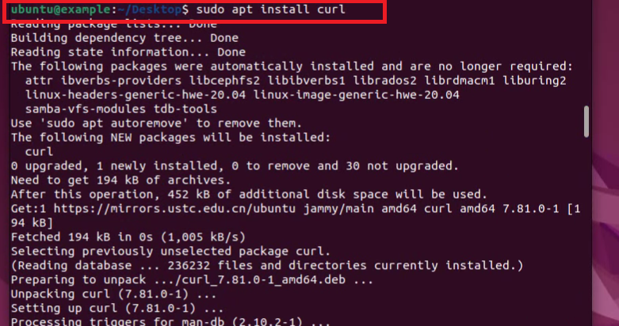

### 安装zsh：

`sudo apt install zsh`

### 查看当前系统中可使用的shell：

`cat /etc/shells`

### 如果没有vim先安装vim：

`sudo apt install vim`

### 进入passwd以后按a进行编辑将默认的bash换成zsh，然后按ESC，退出编辑模式输入：wq保存：

`sudo vim /etc/passwd`

### 安装oh-my-zsh用于快速配置zsh，先下载crul：

`sudo apt install crul`

### 然后安装git：

`sudo apt install git`

### 从gitee上进入zsh：

`sh -c "$(curl -fsSL https://gitee.com/Devkings/oh_my_zsh_install/raw/master/install.sh)"`

### 

### 下载自动补全插件：

`wget -P ~/.oh-my-zsh/plugins/incr http://mimosa-pudica.net/src/incr-0.2.zsh`

### 重启以后并打开终端：
### [返回目录-Linux初级指导教程](https://nya-wsl.com/Linux初级指导教程/)