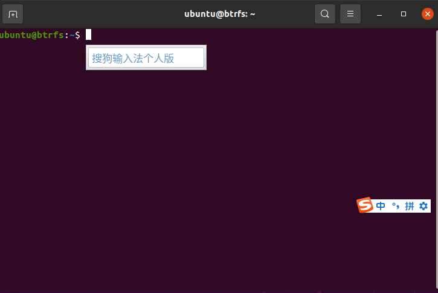

## 下载搜狗输入法

#### 进入火狐浏览器用bing.com搜索搜狗输入法

#### 点击输入法linux版：

#### 下载x86版本：

#### 这样就表示下载完成了：

#### 下载完成后通过如下指令进行安装：`cd ../Downloads` ---------到Downloads路径

#### 下载完成后，通过如下指令进行安装：

`sudo dpkg -i sogoupinyin_4.0.0.1605_amd64.deb`

### 首次安装时，会有依赖关系未解决，通过如下指令自动解决依赖：

`sudo apt install -f -y`

### 解决完依赖关系后，重新安装，指令是:

`sudo dpkg -i sogoupinyin_4.0.0.1605_amd64.deb`

### 然后卸载系统自带的ibus输入法框架，指令是：

``sudo apt remove --purge ibus -y`

### 然后安装两个依赖，指令是：

`sudo apt install libqt5qml5 libqt5quick5 libqt5quickwidgets5 qml-module-qtquick2`

`sudo apt install libgsettings-qt1`

### 编辑文件：

`sudo vim .xprofile`

### 将下面代码复制进去：

`export XMODIFIERS="@im=fcitx"`
`export XIM="fcitx"`
`export XIM_PROGRAM="fcitx"`

`export GTK_IM_MODULE="fcitx"`
`export QT_IM_MODULE="fcitx"`

`fcitx &`

#### esc退出编辑

#### ：wq保存退出

### 接着重启系统，指令是：

`sudo reboot`

#### 接着是配置搜狗输入法：点击键盘图标，然后点击配置

#### 点击左下角的加号

#### 取消only show current language

#### 找到sougou并点击右下角的ok

### 然后关闭配置，打开终端，按住ctrl+空格就可以使用搜狗输入法了：

### 配置字符集

#### 1.ubuntu特有的一种方式

`sudo dpkg-reconfigure-locales`

#### 找到英文字符集

`en_us.iso-8859-1`

`en_us.iso-8859-15 iso-8859-15`

#### tab 然后回车

#### 之后选择一种默认语言

#### 2.通用方式

`sudo vim /etc/locale.gen`

#### 将en_US ISO-8859-1

#### en_US.ISO-8859-15 ISO-8859-15 前面的#号删去

`zh_CN GB2312`
`zh_CN.GB18030 GB18030`
`zh_CN.GBK GBK`
`zh_CN.UTF-8 UTF-8`

#### 将前面的#号删去

#### esc  :wq 保存退出

#### 生成字符集

 `sudo locale-gen`

`local`

#### 安装中文源包

`apt search chinese`

#### 修改文件

`vim /etc/enviroment`

#### 可以指定系统的源

#### 加上

`LANG=CN`

`LANGUAGE=zh_cn`

`LC_CTYPE=“zh_cn.UTF-8"`

#### 重启虚拟机

## 下载WPS

#### 进入浏览器宿舍搜索WPS

#### 安装wps

#### 将位置改为桌面

`cd`

`sudp dpkg -i Downloads/wps-office_11.1.0.10920.XA_amd64.deb`

#### 点击Activities

#### 搜索wps

#### 进入WPS会要求同意一个协议

#### 下载符号字体

#### 浏览器搜索服务器

`web.tecxz.com:9080`

#### 解压资源包

#### 将文件移动到固定的文件夹中,顺便改个名字。

`sudo mv wps-fonts-master/wps /usr/share/fonts/wps-fonts`

#### 更新当前用户下面的字体目录

`fc-cache -fv`

#### 下载微信

#### 浏览器搜索服务器

`web.tecxz.com:9080`

#### 下载完成后安装

`sudo dpkg -i weixin_2.1.1_amd64.deb`

#### 远程桌面

#### 下载srdp(远程桌面协议)

`sudo apt install xrdp`

#### 启动xrdp

`sudo systemctl restart xrdp`

#### 查看启动状态

`sudo systemctl status xrdp`

#### 启动开机自启

#### 添加xrdp的用户组，赋予用户权限

编辑

`sudo vim /etc/xrdp/startwm.sh`

#### 添加

`Unset`

`DBUS_SESSION_ADDRESS`
`Unset XDG_RUNTINE_DIR`

#### esc

#### ：wq  保存退出

#### 重新启动虚拟机

`sudo reboot`

#### 完成后用windows的远程桌面去连接

输入IP

### [返回目录-Linux初级指导教程](https://nya-wsl.com/Linux初级指导教程/)
