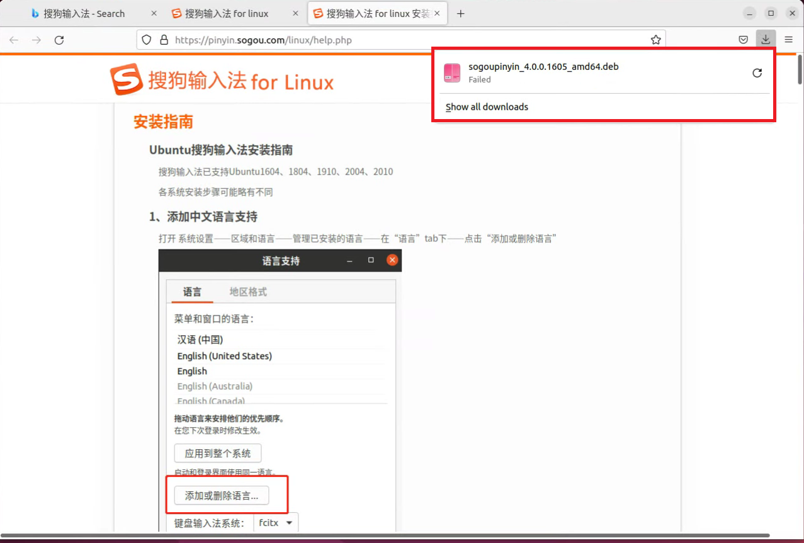

### 搜狗输入法：进入火狐浏览器用bing.com搜索搜狗输入法

### 点击输入法linux版：

### 下载x86版本：

#### 这样就表示下载完成了：

### 下载完成后通过如下指令进行安装：`cd ../Downloads` ---------到Downloads路径

### 下载完成后，通过如下指令进行安装：

`sudo dpkg -i sogoupinyin_4.0.0.1605_amd64.deb`

### 首次安装时，会有依赖关系未解决，通过如下指令自动解决依赖：

`sudo apt install -f -y`

### 解决完依赖关系后，重新安装，指令是:

`sudo dpkg -i sogoupinyin_4.0.0.1605_amd64.deb`

### 然后卸载系统自带的ibus输入法框架，指令是：

`sudo apt remove --purge ibus* -y`

### 然后安装两个依赖，指令是：

`sudo apt install libqt5qml5 libqt5quick5 libqt5quickwidgets5 qml-module-qtquick2`

`sudo apt install libgsettings-qt1`

### 接着重启系统，指令是：

`sudo reboot`

接着是配置搜狗输入法：点击键盘图标，然后点击配置

### 点击左下角的加号

### 取消only show current language

### 找到sougou并点击右下角的ok

### 然后关闭配置，打开终端，按住ctrl+空格就可以使用搜狗输入法了：

### [返回目录-Linux初级指导教程](https://nya-wsl.com/Linux初级指导教程/)