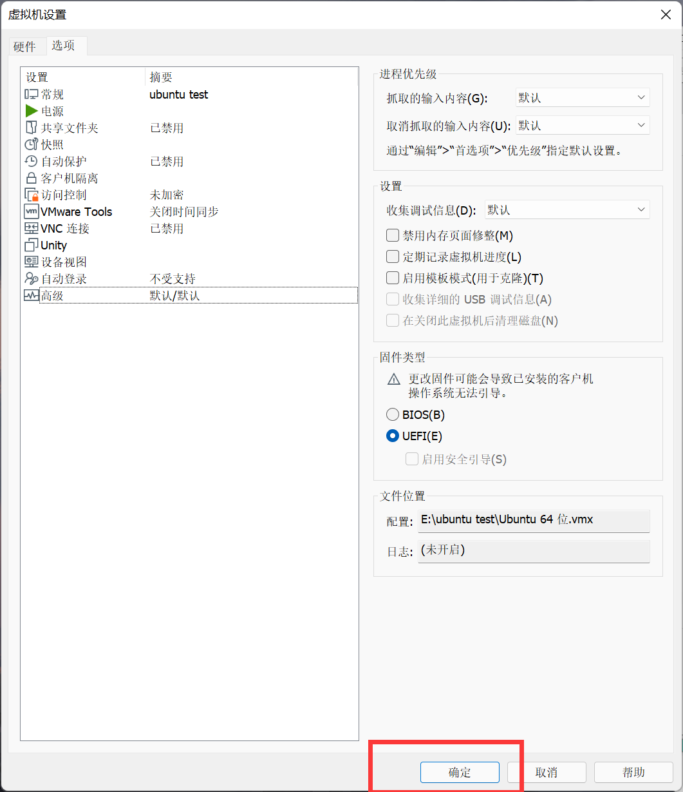

## 加一块虚拟盘

### 更改固件类型

将固件类型改为UEFI

确定即可

## 配置新盘 (分区)

#### 1.打开虚拟机，连接MobaXterm

#### 2.输入lsblk查看新建设备信息

`lsblk`

#### 3.用gdisk命令来进行划分盘

#### 	gdisk又叫GPT ，算是fdisk的延伸，主要使用的是GPT分区类型。

### 操作选项

b 将GPT数据备份到一个文件
c 更改分区名称
d 删除一个分区
i 显示分区详细信息
l 列出已知分区类型。此处8200是Linux swap，8300是Linux filesystem（对应fdisk的82和83）。还有一个8e00是Linux LVM
n 增加一个新的分区
o 创建一个新的空白的GPT分区表
p 显示当前磁盘的分区表
q 退出gdisk程序，不保存任何修改
r 恢复和转换选项（仅限专家）
s 排序分区
t 改变分区的类型
v 验证磁盘分区表
w 将分区表写入裁判并退出（保存并退出）
x 额外功能（仅限专家）
? 显示帮助信息

### 具体操作

#### 4.创建空白分区

`sudo gdisk /dev/sdb`

`o`

#### 5.将分区表写入裁判并退出（保存并退出）

`w`

#### 6.添加一个新的分区

`sudo gdisk /dev/sdb`

#### n 回车 回车 回车 +512M  ef00      **（必须是大写的M）**

#### 7.再添加一个新的分区

#### n 一直回车即可

#### 8.创建完后查看一下是否创建成功

`p`

#### 9.之后对两个新创建的盘进行命名

`c`

#### 1、2代表的是硬盘编号

#### 10.编辑完之后存盘退出

`w`

#### 11.格式化引导分区

`sudo mkfs.vfat -F32 /dev/sdb1`

`sudo mkfs.ext4 /dev/sdb2`

#### 12.创建一个名为usb的目录

`sudo mkdir /mnt/usb`

#### 13.再创建boot/efi目录

`sudo mkdir /mnt/usb/boot/efi -p`

#### 14.下载debootstrap

#### 是Twitter推出的一个用于前端开发的开源工具包。它由Twitter的设计师Mark Otto和Jacob Thornton合作开发,是一个CSS/HTML框架。

`sudo apt install debootstrap`

#### 15.下载arch-install-scripts

`sudo apt install arch-install-scripts`

#### 16将磁盘挂载到文件夹

`sudo mount /dev/sdb2 /mnt/usb/`

`sudo mount /dev/sdb1 /mnt/usb/boot/efi/`

#### 17.查看一下是否挂载成功

`lsblk`

### [返回目录-Linux初级指导教程](https://nya-wsl.com/Linux初级指导教程/)