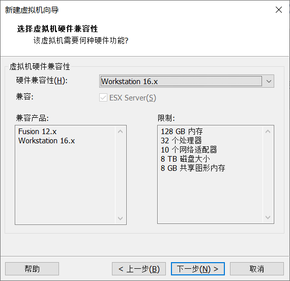
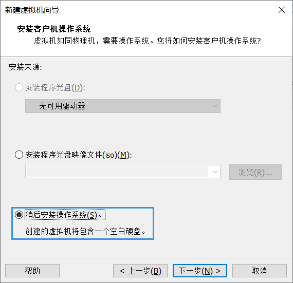
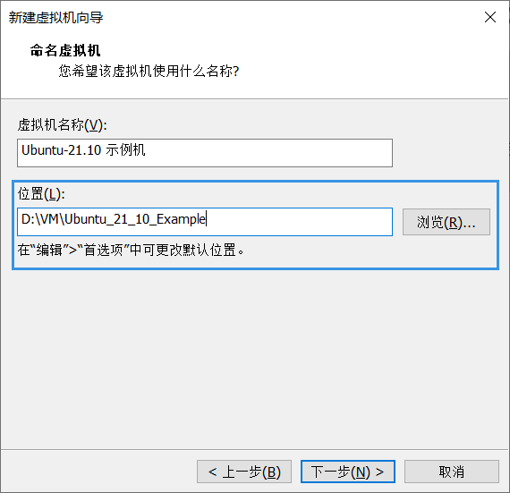
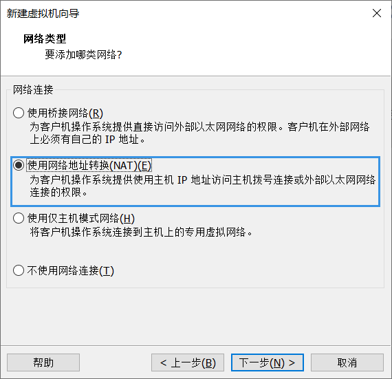
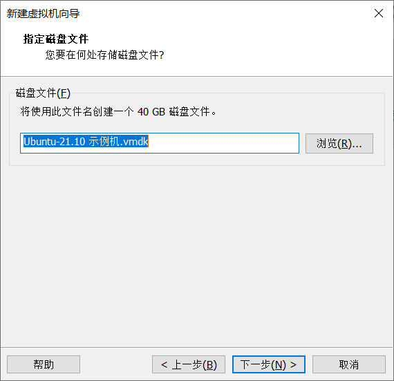
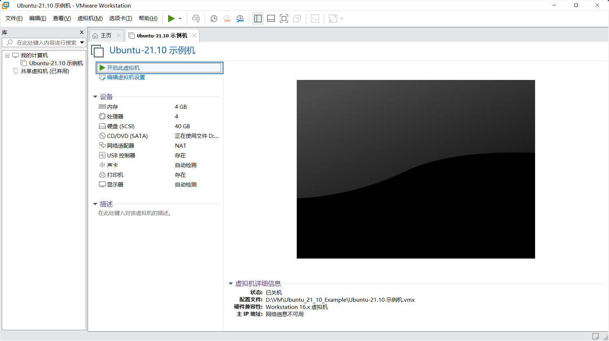
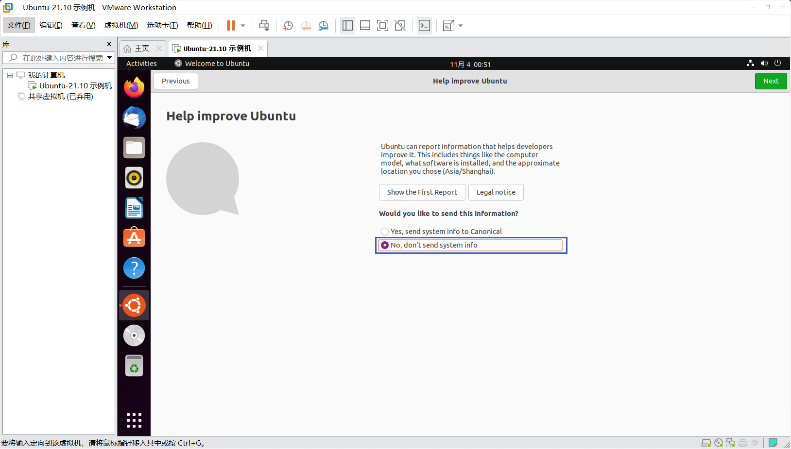

### 1）运行Vmware Workstation，在主页选择“创建新的虚拟机”，或通过单击“文件(F)”-"新建虚拟机(N)"以进行新建虚拟机向导

 2）选择使用“自定义(高级)(C)”进行配置，点击下一步

 3）选择硬件兼容性为“Workstation 16.x”，点击下一步

4）选择“稍后安装操作系统(S)”，点击下一步

5）选择客户机操作系统为“Linux(L)”,版本为“Ubuntu 64 位”，点击下一步

 6）根据个人需要设置“虚拟机名称(V)”，选择虚拟机部署“位置(L)”的目录，点击下一步

7）根据个人的电脑性能，为虚拟机分配处理器数量。此步骤建议图形化安装时不低于1个处理器及2个内核数，点击下一步

**只有至少具有两个逻辑处理器的主机才支持指定多个虚拟处理器，启用了超线程或具有双核 CPU 的单处理器主机可视为具有两个逻辑处理器。具有两个 CPU 的多处理器主机无论是否为双核处理器或是否启用了超线程，均视为至少具有两个逻辑处理器**

**对于主要运行 Office 和 Internet 办公应用程序的 Windows 虚拟机来说，使用多个虚拟处理器不会带来优势，因此，使用单个虚拟处理器的默认设置较为理想。对于服务器工作负载和数据密集型计算应用程序，添加额外的虚拟处理器可以提高应用程序的性能**

**一个CPU有多个内核(常见的有:单核/双核/四核/六核/八核)，一个内核一般对应一个线程。但通过超线程技术，一个核心可以对应两个线程，即可以同时运行两个线程，并行处理两个任务**

**下表为建议的处理器数量，可供参考**

| 应用程序                 | 建议的处理器数量 |
| ------------------------ | ---------------- |
| 桌面应用程序             | 1 个处理器       |
| 服务器操作系统           | 2 个处理器       |
| 视频编码、建模和科学运算 | 4 个处理器       |

 ### 8）根据个人的电脑性能，为虚拟机分配内存大小。此步骤建议图形化安装时设置不低于2048MB的内存，点击下一步

### 9）选择网络连接模式为“使用网络地址转换(NAT)(E)”，点击下一步

 ### 10）选择I/O控制器类型为“LSI Logic(L)”用于SCSI虚拟磁盘，点击下一步

### 11）选择磁盘类型为"SCSI(S)"，点击下一步

### 12）选择“创建新虚拟磁盘(V)”，点击下一步

### 13）根据个人的电脑性能，为虚拟机分配磁盘大小。此步骤建议图形化安装时设置不低于40GB磁盘大小，并选择"将虚拟磁盘存储为单个文件(O)"，点击下一步

### 14）根据个人需要设置“磁盘文件(F)”，点击下一步

### 15）确认新建虚拟机设置无误，点击完成以结束新建虚拟机向导

## ***\*2.挂载安装程序光盘映像文件\****

### 1）在“我的计算机”中找到新建的虚拟机，单击后选择“编辑虚拟机设置”，或用右键单击虚拟机名称，选择“设置(S)...”

### 2）选择“CD/DVD(SATA)”，在连接中选择“使用ISO映像文件(M)”，单击“浏览(B)...”

### 3）进入之前下载镜像的保存路径，选中下载好的镜像文件，单击“打开”

### 4）确认镜像文件选择正确，单击“确定”

### 5）单击“开启此虚拟机”

## ***\*4.完成系统部署引导\****

### 1）等待进入GNU GRUB启动引导程序，单击画面，使用“↑”与“↓”键移动至“Ubuntu”，按“Enter”键以进入安装引导

### **在引导程序中，在自动读秒结束后会默认进入高亮选项，也就是进入“Ubuntu”进行安装引导**

### **如在无图形化界面中想要释放鼠标，可按“Ctrl”+“Alt”进行释放**

### 2）等待进入Ubuntu安装欢迎界面，按个人需要选择系统语言，此步骤建议选择默认的英语“English”，单击“Install Ubuntu”以进行安装部署

**为了更好的使用及学习Linux系统的目录结构、功能与特性等，系统语言尽量选择为英语“English”**

### 3）按个人需要设置键盘布局，此步骤建议选择默认的英语(美国)“English(US)”，点击“Continue”

**选择中文“Chinese”的键盘布局与英语(美国)“English(US)”无区别**

### 4）选择正常安装“Normal Installation”，同时选择在安装Ubuntu时下载更新“Download updates while installing Ubuntu”，点击“Continue”

**最小安装“Minimal Installation”为无图形化安装，如果虚拟机无网络，可以取消选择在安装Ubuntu时下载更新**

### 5）选择安装类型为清除整个磁盘并安装Ubuntu“Erase disk and install Ubuntu”，点击“Install now”

**如果熟悉Linux系统的逻辑卷管理与磁盘格式文件系统，可以使用高级特性...“Advanced features...”或其他选项“Something Else”进行自定义设置**

### 6）确认磁盘分区设置，点击“Continue”

### 7）选择地区为上海“Shanghai”，可以在输入框中输入，或者点击地图对应位置，点击“Continue”

### 8）设置你的姓名“Your Name”

安装引导将自动生成您的计算机名“Your computer's name”与选择一个用户名“Pick a username”，亦可根据个人需要进行修改，同时选择一个密码“Choose a password”，并确认您的密码“Confirm your password”。选择登录时需要密码“Require my password to log in”，点击“Continue”

### 9）安装程序启动，等待安装完成

**图形化安装时间大约在10-20分钟。根据电脑性能，安装时间可能会更快或更长**

### 10）安装完成后，系统自动弹出重启确认界面，单击“Restart Now”

### 11）右键左下角的光碟图标，选择“断开连接(D)”以移除安装介质，并按“Enter”键，或等待自动移除安装介质后进入系统

## ***\*5.进行最后设置\****

1）点击用户，输入密码后“Enter”键登录

2）单击“Skip”跳过连接在线账户

3）关闭定位服务“Location Services”，单击“Next”

4）根据个人需要，选择是否帮助Ubuntu改进，如不需要则选择“No,don't send system info”，点击“Next”

5）部署配置已完成，点击“Done”退出最后设置引导

### [返回目录-Linux初级指导教程](https://nya-wsl.com/Linux初级指导教程/)